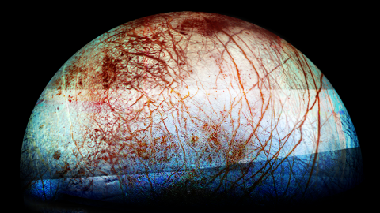

title=Have we landed on Europa
description=Have humans ever landed on Europe?
image=./europa-surface.jpg
date=2023-02-10
publish=true
@@@

# Have we landed on Europa

**Humans: Not yet**

**Robots: Not yet**

## How close have we gotten?

The closest that a spacecraft has come to Europa is the Galileo spacecraft on December 16, 1997, when the spacecraft passed just 671 kilometers (416 miles) above the moon's surface.

The Galileo spacecraft was launched by NASA in 1989 and arrived at Jupiter in 1995. During its mission, Galileo made several flybys of Europa and captured high-resolution images of the moon's surface. During this flyby, Galileo gathered data about Europa's magnetic field, ionosphere, and surface features, which have helped scientists understand more about the moon's potential habitability.

While Galileo's flybys of Europa have been the closest encounters so far, future missions to the moon are being planned to further explore its potential for life and to gather more data about its geology and subsurface ocean.

## What are the Galilean moons?

The Galilean moons are a group of four large moons of Jupiter: Io, Europa, Ganymede, and Callisto. These moons were discovered by Galileo Galilei in 1610 and were the first objects found to orbit another planet. They are among the largest objects in the solar system beyond the eight planets, with Ganymede being the largest moon in the solar system.

Io is the innermost of the Galilean moons and is the most volcanically active object in the solar system. Europa is a world of ice and ocean and is considered one of the best candidates for life in our solar system. Ganymede is the only moon in the solar system known to have a magnetic field, and Callisto may have a subsurface ocean.

The Galilean moons have been the subject of much scientific study and are considered important objects for understanding the formation and evolution of the solar system.
