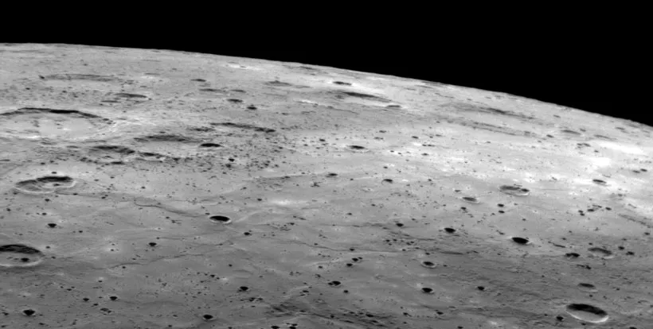
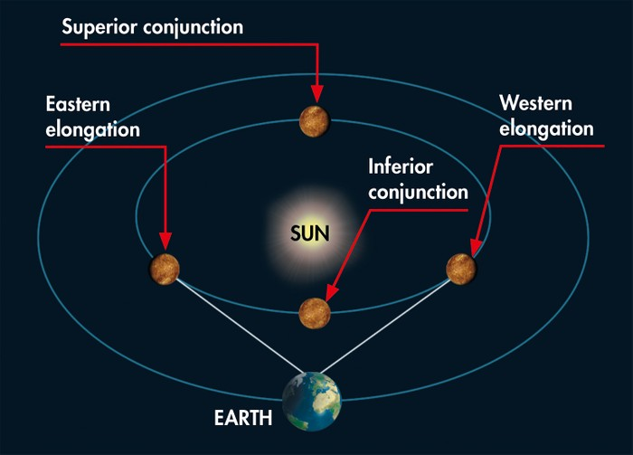

title=Have we landed on Mercury
description=Have humans ever landed on Mercury?
image=./mercury-surface.jpg
date=2023-01-26
publish=true
@@@

# Have we landed on Mercury?

**Humans: Not yet**

**Robots: Not yet** (unless you count the crashed remains of MESSENGER)

As of 2023 there has not been a sucessful landing of a spacecraft on Mercury.

Mercury is a difficult planet to study because of its proximity to the Sun and the intense heat and radiation that it experiences. In addition, it has a heavily cratered surface and a weak magnetic field, which makes it challenging to land a spacecraft there safely.

However, NASA's MESSENGER spacecraft (MErcury Surface, Space ENvironment, GEochemistry, and Ranging) orbited Mercury between 2011 and 2015 and provided detailed information about the planet's geology, geochemistry, and magnetic field. The MESSENGER spacecraft met an sudden end April 30, 2015 when it ran out of fuel and crashed into the planets surface.

NASA's BepiColombo mission, which was launched in 2018, is currently in orbit around Mercury, studying the planet's geology, geophysics, and surface properties.

## How's the weather on Mercury

Because of the lack of atmosphere, there are no clouds, rain, or winds on Mercury. The temperature on the surface of Mercury varies greatly depending on the location and time of day, as the planet has a very slow rotation and it rotates once every 58.6 Earth days.

On the day side, the temperature can reach up to 430 °C (800 °F) and on the night side it can drop to -180 °C (-292 °F) . The temperature difference between day and night side of the planet is about 600 degrees celsius.

Mercury does have a magnetic field, which is about 1% as strong as Earth's magnetic field, and it protects the planet from some of the solar wind's charged particles. However, the planet is still exposed to a significant amount of solar radiation, which can cause the surface to become extremely hot during the day.

Mercury's surface is also continuously bombarded by micrometeoroids, which can cause impact craters and other surface features.

## How long does it take to get to Mercury?

Mercury's closest approach to Earth, called "inferior conjunction", occurs when Mercury is between the Sun and Earth. At this point, the distance between Mercury and Earth can be as close as 77 million km (48 million miles) and as far as 227 million km (141 million miles). This means that at its closest point (perihelion) to its farthest point (aphelion) it can vary by 150 million km (93 million miles)

It's worth noting that inferior conjunctions of Mercury happen about 13 or 14 times per century. It's not a frequent event. **However the most recent interior conjunction was January 7 2023.**

NASA's MESSENGER spacecraft, which orbited Mercury between 2011 and 2015, was launched in 2004 and took about 7 years to travel to Mercury. The BepiColombo mission, which was launched in 2018, took approximately 7.3 years to reach Mercury.

If a spacecraft is launched when Earth and Mercury are at their closest point in their respective orbits ("inferior conjunction"), the journey would take less time than if the launch occurred when the two planets were at their farthest point (superior conjunction).

If we use conventional propulsion it would take around 4-5 years to reach Mercury, but with the use of advanced propulsion system, like solar electric propulsion, we could cut the journey time by half.

It's also worth noting that most missions to Mercury are not direct flights, but instead use gravity assist maneuvers to increase the spacecraft's speed and change its trajectory. These maneuvers can add time to the overall journey, but they also allow the spacecraft to save fuel and complete its mission more efficiently.
