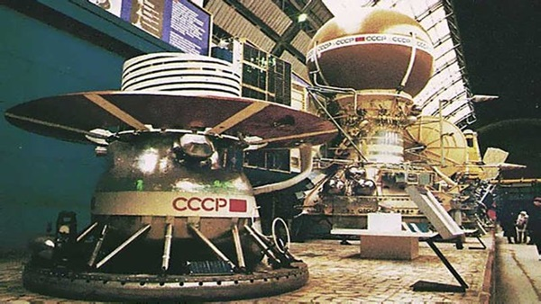
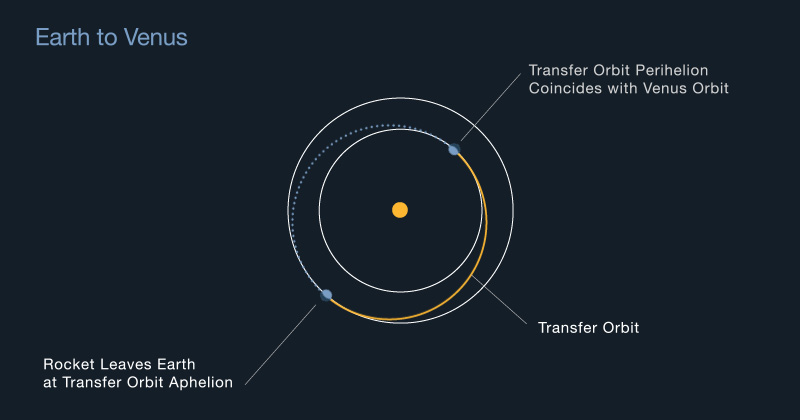

title=Have we landed on Venus
description=Have humans ever landed on Venus?
image=./venus_surface.jpg
date=2023-01-25
publish=true
@@@

# Have we landed on Venus?

**Humans: Not yet**

**Robots: Yes**

In total, four spacecraft have landed on the survace of Venus, but none have survived for more than a few hours. The Venusian atmosphere is thick, toxic, and plagued by clouds of sulfuric acid. With a surface pressure of about 90 times than Earth's atmosphere and a average temperature of 864 degrees Fahrenheit, it's nearly impossible for probes to survive for more than a few hours.

The Soviet Union's Venera landers in the 1970s and 1980s were able to survive for a short period of time on the surface, but no surface missions have been attempted since 1982. Currently, the only way to study the Venusian surface is through orbiting spacecraft and atmospheric probes.

## The Venera Landers

The last successful surface mission to Venus was the Soviet Union's Venera 14, which landed on the Venusian surface on March 5, 1982. The Venera 14 probe was able to survive on the surface for about 57 minutes, during which it was able to transmit data about the Venusian surface and atmosphere back to Earth.

Since then, several spacecraft have been sent to Venus for atmospheric and orbiting studies, but none have attempted a surface landing. NASA's Magellan mission orbited Venus from 1990-1994 and mapped 98% of the Venus surface with radar. The European Space Agency's Venus Express mission orbited Venus from 2006-2014 and studied the Venusian atmosphere. The Japanese space agency [JAXA's Akatsuki mission](https://en.wikipedia.org/wiki/Akatsuki_%28spacecraft%29) has been orbiting Venus since December 2015.

## So how bad is the Venusian atmosphere?

The surface conditions on Venus are extremely harsh and hostile. The planet has a thick, toxic atmosphere that is mostly made up of carbon dioxide, with clouds of sulfuric acid. The atmospheric pressure on the Venusian surface is about 90 times that of Earth, which is equivalent to being about 900 meters (3,000 feet) underwater on Earth. This intense pressure would crush any spacecraft or lander that is not specifically designed to withstand it.

The temperature on the Venusian surface is also extremely high, with an average temperature of about 864 degrees Fahrenheit (462 degrees Celsius). This extreme heat is caused by a greenhouse effect created by the thick atmosphere trapping heat from the sun. The surface of Venus is also constantly bombarded by ultraviolet radiation, which would quickly degrade any materials used in a spacecraft or lander.

## How long does it take to get to Venus?

It takes about 3 - 4 months to reach Venus using the "Hohmann transfer" orbit. This type of orbit uses gravity to "slingshot" the spacecraft towards its destination, and takes advantage of the relative positions of Venus and Earth in their orbits to minimize the energy needed for the trip.

There is always a tradeoff between speed and fuel consumption however. With the 2005 Venus Express spacecraft completing the trip in 6 months using a more complex (but fuel efficient) slingshot manuver.

## Why haven't we gone back?

There are a few reasons why there haven't been many recent missions to Venus since the 1980s.

1. **The weather sucks.** Even 40 years after the Soviet Venera landers, it's unlikely we could maintain a permanant surface lander. Meanwhile orbital imaging has improved dramatically. Allowing satellites like the Japanese Akatsuki probe to transmit valuable information safely from orbit.

2. **Funding.** The exploration of Mars and the search for signs of life on that planet has been a major focus for NASA and other space agencies in recent years, and this has taken up a significant amount of resources and funding.

3. **We have a lot of data.** The Soviet Venera missions in the 1970s and 1980s provided an incredible amount of data on surface conditions. And later missions with the European Space Agency's Venus Express and Japanese space agency JAXA's Akatsuki mission have provided extensive surface mappings. This missions have provided a wealth of data about the planet's atmosphere and surface, and scientists have been analyzing this data for many years.

However, there is a renewed interest in Venus, NASA has planned [a new Venus mission called VERITAS](https://solarsystem.nasa.gov/missions/veritas/overview/) (Venus Emissivity, Radio Science, InSAR, Topography, and Spectroscopy) that is scheduled to launch before 2030 and several other space agencies including JAXA, ISRO and Roscosmos are also planning Venus missions in the near future.
