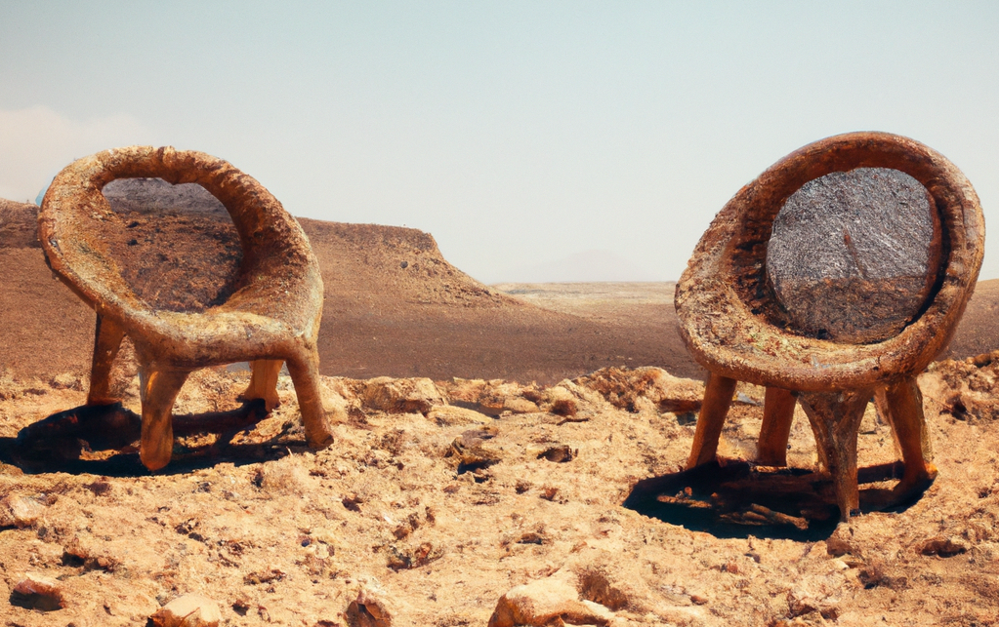
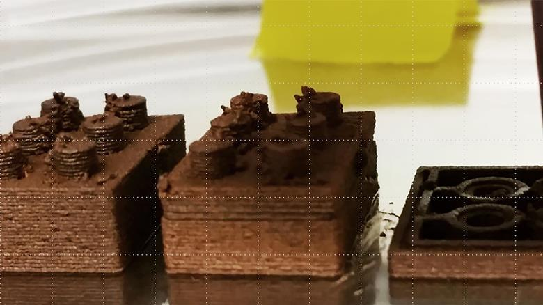
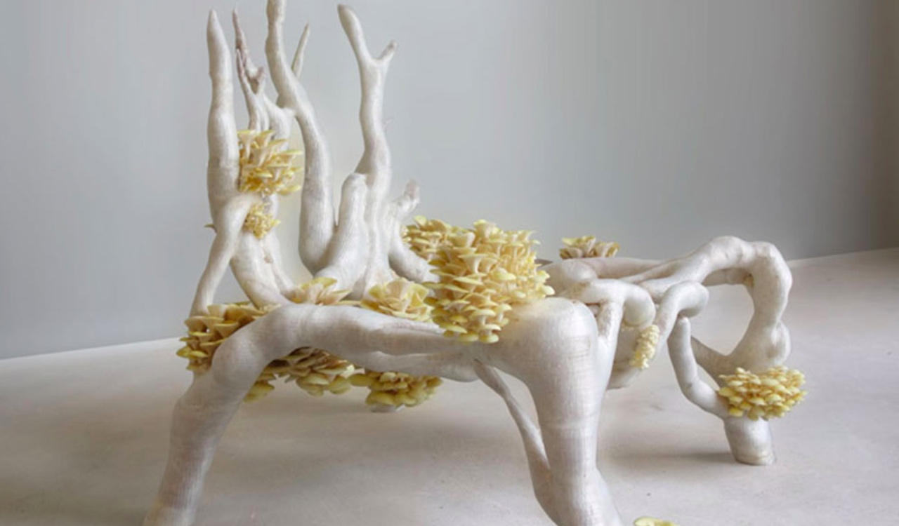
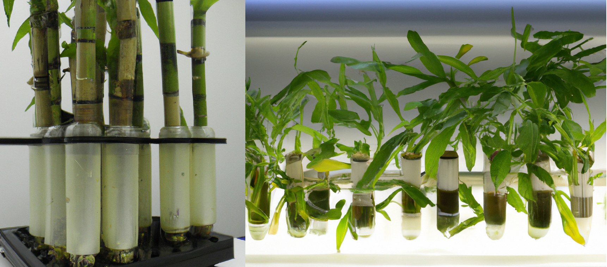
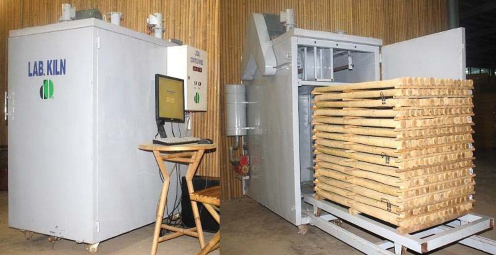
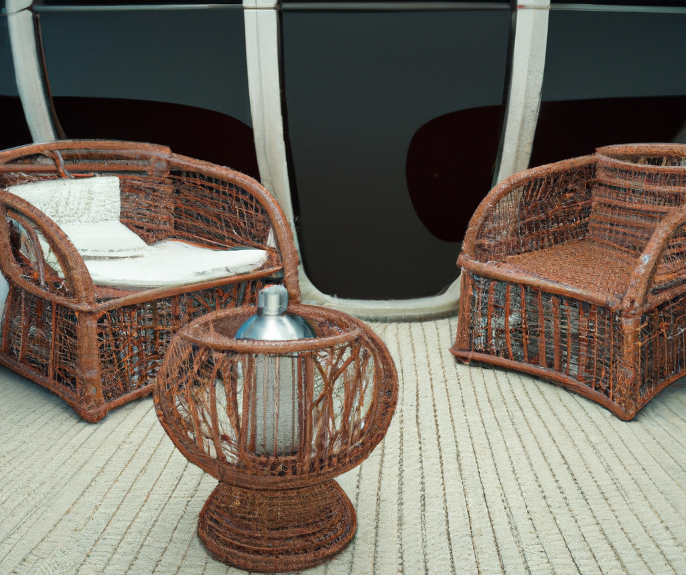

title=Mars will have a lot of wicker furniture
description=So we've landed on Mars, now we need somewhere to sit. It's pretty expensive to ship furniture from earth, so time to start building some chairs.
image=https://havewelanded.com/mars-wicker-chairs.png
date=2023-02-28
publish=true
@@@

# Mars will have a lot of wicker furniture

<small><i>Mars wicker chairs - DALL-E</i></small>

## Where are we gonna sit?

So we've landed on Mars, now we need somewhere to sit. It's pretty expensive to ship furniture from earth, so time to start building some chairs with all of the bountiful resources available on Mars. (_gestures at empty desert_)

There's plenty of speculation on how we will end up building on Mars, but I feel one of the more simple and obvious ideas has been left out: Bamboo / Wicker Furniture.

-   **Fast growing**
    -   Reed/Bamboo can grow 12" per day.
-   **Water neutral**
    -   90%+ water reclaimed in drying process.
-   **Compostable**
    -   Old/damaged furniture returned to system.
-   **Moderate energy requirements**
    -   Grow lights & kiln drying.
-   **It comes in the right shape!**
    -   No 3D printing or injection molding required. Just cut and bend to desired shape.

## Can't we build with Martian regolith?

<small><i>Adam Jakus / Ramille Shah / Northwestern University</i></small>

Why not! After all experiments with regolith simulants have been used to build 3D printed tools, structures, solar panels, and even rocket fuel! [[1]](https://spectrum.ieee.org/how-nasa-will-use-robots-to-create-rocket-fuel-from-martian-soil)

Regolith manufacturing has become a sort of snake oil for Martian engineering. Every problem seems to have a cool regolith based solution. But in practice, most of these experiment are using 5-10% Martian simulant and leaving the remaining 90% to traditional binding agents.

While I'm certain we could build something chair shaped with Martian dust; it has a few major shortfalls:

1. Massive amount of energy required to process
2. Typically requires additional binding agents (from Earth)
3. Humans don't want to sit on radioactive concrete chairs all day

I believe there is potential for regolith manufacturing, but it's applications will be more cinder-block and less comfy-chair.

## What about bioplastics?

<small><i>Studio Eric Klarenbeek bioplastic chair</i></small>

Bioplastics are another great option, but with a few limiting factors for chair production.

1. Bioplastics will be a precious commodity for replacing small parts throughout the station
2. Large plastic extrusions require a lot of heat and heavy custom dies

### The basics of bioplastic engineering:

1. Grow some corn (and eat the good part)
2. Take the leftovers cobs, leaves, and stalks to grind down and make vegetable oil
3. Process the vegetable oil into Polylactic Acid (PLA)
4. Injection mold or 3d Print using the bioplastics

Likely bioplastics will be integral to the continued survival of a Martian colony. But production of bioplastics is costly from both a raw material standpoint (crops that could otherwise be eaten), and a processing perspective (uses up reagents that would not be immediately replenishable on Mars). It is more reasonable to assume that bioplastic production will be reserved for small mission critical replacement parts.

## Bamboo to the rescue

If our Martian colony needs a tried and true construction material, look no further than one of oldest and most popular

<small><i>Hydroponic bamboo sprouts</i></small>

<small><i>Kiln drying bamboo (225 stalks)</i></small>

Reed (Phragmites) & Bamboo (Bambusoideae) do quite well hydroponically, it's roots are water resistant, and the same plant can be harvested multiple times. It does run into a bit of a height limitation. In order to harvest ~2 meters of usable stalk you'll probably need 3 meters of vertical growing space. Which might be limited in your Martian bunker.

But as long as you have high ceilings, a 3m x 3m room could easily house your entire furniture production studio.

The process will look something like this:

1. Grow bamboo in hydroponic garden (~6-8 months initially)
2. Cut off useful portion of bamboo (leaving base & root structure for future growth)
3. Bend to desired shape while green (or leave staight)
4. Kiln dry and condense water back into system

### Reclaiming water

Maintaining a closed loop with water will be vital to survival on Mars. Sure we could theoretically go pick up some more from the North Pole. But our best bet will be maintaining whatever we brought with us.

Which leads to a minor problem with our continued furniture problem: _bamboo absorbs moisture from the air_.

In the average air conditioned home, bamboo will balance out at ~10% humidity. So imagine you had a 3kg bamboo chair, that chair would absorb 300 grams of water (0.30 liters).

Your 6 piece Martian dining set would likely horde 3-4 liters of water. It's not lost from the system, as it could always be composted back into your grow medium. But it's worth understanding before you launch a full scale furniture business on Mars.

## Relax and enjoy your new Martian chair

Turns out space will look a lot less like Star Trek, and a lot more like your grandma's sitting room. It may not be the sexiest Martian engineering strategy, but it's the one that will work!

<small><i>Wicker chairs on spaceship - DALL-E</i></small>

 
 
 
 
 

Tyler Maran - [@TylerMaran](https://twitter.com/TylerMaran) - [tylermaran.com](https://tylermaran.com)
