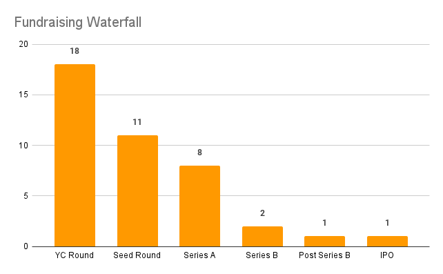

title=Y-Combinator's top space industry investments
description=A brief history of YCombinator's investments in the space industry. YC has made 18 investments into spacefaring startups since 2012. To date 12 of these startups received follow-on investments, 8 received additional...
image=https://havewelanded.com/fundraising_waterfall.png
date=2023-01-20
publish=true
@@@

# YC's 18 space industry investments

Y Combinator (YC) is a startup accelerator and venture capital firm that's invested in more than 3,500 companies. Of that 3,500 company portfolio the majority has always been software (with b2b SASS making up ~70%). **But** there's a tiny sliver of that pie pointed towards space. And that's what I'm most interested in tracking.

I've compiled a list of companies working on developing technology and infrastructure for space exploration, satellite deployment, and space-based services such as communication and data collection. YC's investment in these companies reflects the growing interest in the commercial space industry and the potential for innovation and growth in this field.

_All the data here is pulled from the [YC company directory](https://www.ycombinator.com/companies), searching by space, satellite, rocket, etc. and thrown into a [spreadsheet](https://docs.google.com/spreadsheets/d/1cGQw-l4RnYFPNogkcYjo4dCHwPhw_tWs_M6cBOSi3h8/edit#gid=0)). If you think there's some missing companies shoot me an [email](mailto:tyler.maran@gmail.com) and I'll update the list._

### Summary financials

Since 2016, Y Combinator has invested in 18 companies in the space sector, with 11 of them receiving additional investment from other venture capital firms. To date, only 2 of these companies have made it beyond Series B funding rounds. This suggests that while Y Combinator has been actively investing in space companies, the majority of these companies are still in the early stages of development and have not yet reached the level of maturity and success that would warrant later-stage funding.

This is not uncommon for startups, especially in high-risk, high-tech industries like space. The fact that 12 of the companies received additional investment from other venture capital firms, despite the small number of companies that have reached later stages, may reflect the growing interest in the space industry and the potential for innovation and growth in this field.

### Investments per year

_Grouped by YC investment year (i.e. W19, S19)_

While the number of investments in space companies by Y Combinator and other venture capital firms is increasing, it is still relatively small compared to overall investment activity. Space companies made up 1% of YC's total cohort. Practically a rounding error.

This can be seen as an indication that the space industry is still in its early stages of development, and that the potential for growth and innovation is significant. Additionally, it can also indicate that the venture capital community is still cautious about investing in space companies, as the industry has high technical and regulatory barriers, and a high level of risk. Despite this, the increasing investments in space companies demonstrates the growing interest and confidence in the potential of the space industry as a viable commercial sector.

## Who are the founders

I was honestly quite surprised by the diversity here. I had expeced to see 38 ex-SpaceX / ex-Blue Origin founders here. But that only accounts for 7 of the 18 companies. All invetments had at least one cofounder with prior aerospace experience.

<table>
<thead>
<tr><th>Founder</th><th>Company</th><th>Notable Experience</th></tr>
</thead>
<tbody>
<tr><td><a href="https://www.linkedin.com/in/tim-ellis-11167172/">Tim Ellis</a></td><td>Relativity Space</td><td><b>Blue Origin</b>, Masten Space Systems</td></tr>
<tr><td><a href="https://www.linkedin.com/in/erfrnk">Erik Franks</a></td><td>Tesseract</td><td>Benchmark Space Systems, Masten Space Systems</td></tr>
<tr><td><a href="https://www.linkedin.com/in/jeff-gibson-59866a86">Jeff Gibson </a></td><td>Tesseract</td><td>Masten Space Systems, UTC Aerospace Systems</td></tr>
<tr><td><a href="https://www.linkedin.com/in/kokorich">Mikhail Kokorich </a></td><td>Momentus</td><td>Astro Digital, Helios Wire IoT</td></tr>
<tr><td><a href="https://www.linkedin.com/in/sohrabhaghighat/details/experience">Sohrab Haghighat</a></td><td>SpaceRyde</td><td>Cruise</td></tr>
<tr><td><a href="https://www.linkedin.com/in/saharnaz-safari/details/experience">Saharnaz Safari</a></td><td>SpaceRyde</td><td>Several small startups</td></tr>
<tr><td><a href="https://www.linkedin.com/in/siamak-ebadi-999555a">Siamak Ebadi</a></td><td>UTVATE</td><td><b>SpaceX</b>, Ossia Inc.</td></tr>
<tr><td><a href="https://www.linkedin.com/in/william-crowe-space">William Crowe</a></td><td>HEO Robotics</td><td>UNSW Sydney PHD</td></tr>
<tr><td><a href="https://www.linkedin.com/in/hiranya-jayakody">Hiranya "HJ" Jayakody</a></td><td>HEO Robotics</td><td>UNSW Sydney PHD</td></tr>
<tr><td><a href="https://www.linkedin.com/in/joelsercel">Joel Sercel</a></td><td>TransAstra Corporation</td><td>CalTech</td></tr>
<tr><td><a href="https://www.linkedin.com/in/tylerjpierce">Tyler James Pierce </a></td><td>Turion Space</td><td>ATA Engineering, Lockheed Martin</td></tr>
<tr><td><a href="https://www.linkedin.com/in/rwesterdahl">Ryan W.</a></td><td>Turion Space</td><td><b>SpaceX</b></td></tr>
<tr><td><a href="https://www.linkedin.com/in/patryk-wiatr">Patryk Wiatr</a></td><td>Turion Space</td><td>Marshall Reddick Real Estate</td></tr>
<tr><td><a href="https://www.linkedin.com/in/lauracrabtree">Laura Crabtree</a></td><td>Epsilon3</td><td><b>SpaceX</b>, Northrop Grumman</td></tr>
<tr><td><a href="https://www.linkedin.com/in/maxmednik">Max Mednik</a></td><td>Epsilon3</td><td>Google</td></tr>
<tr><td><a href="https://www.linkedin.com/in/aaron-sullivan-14552a3">Aaron Sullivan </a></td><td>Epsilon3</td><td>Google</td></tr>
<tr><td><a href="https://www.linkedin.com/in/justin-fiaschetti-097b10166">Justin Fiaschetti</a></td><td>Inversion Space</td><td>Relativity Space, <b>SpaceX</b></td></tr>
<tr><td><a href="https://www.linkedin.com/in/austinbriggs7">Austin Briggs</a></td><td>Inversion Space</td><td>ABL Space Systems, Boston University Rocket Propulsion Group</td></tr>
<tr><td><a href="https://www.linkedin.com/in/tom-walkinshaw-94630124">Tom Walkinshaw</a></td><td>Alba Orbital</td><td>Glasgow University</td></tr>
<tr><td><a href="https://www.linkedin.com/in/thomas-w-feldman">Tom Feldman</a></td><td>Stoke Space</td><td><b>Blue Origin</b>, <b>SpaceX</b></td></tr>
<tr><td><a href="https://www.linkedin.com/in/andylapsa">Andy Lapsa</a></td><td>Stoke Space</td><td><b>Blue Origin</b></td></tr>
<tr><td><a href="https://www.linkedin.com/in/topher-haddad-a9a460a4">Topher Haddad</a></td><td>Albedo</td><td>Lockheed Martin</td></tr>
<tr><td><a href="https://www.linkedin.com/in/winstontri">Winston Tri</a></td><td>Albedo</td><td>Facebook</td></tr>
<tr><td>AyJay Lasater</td><td>Albedo</td><td>Lockheed Martin</td></tr>
<tr><td><a href="https://www.linkedin.com/in/joel-darin-b329041a">Joel Darin</a></td><td>Velontra</td><td>Hermeus </td></tr>
<tr><td><a href="https://www.linkedin.com/in/robkeane0321">Robert Keane III</a></td><td>Velontra</td><td>BAE System, GE Aviation</td></tr>
<tr><td><a href="https://www.linkedin.com/in/sandilya-sunny-bhagavathula-13780b47">Sandilya Bhagavathula</a></td><td>Quindar</td><td>R2 Space, One Web</td></tr>
<tr><td><a href="https://www.linkedin.com/in/nathanhamet">Nate Hamet</a></td><td>Quindar</td><td>Orbital Effects, One Web, Lockheed Martin</td></tr>
<tr><td><a href="https://www.linkedin.com/in/david-lawrence-58663691">David Lawrence</a></td><td>Quindar</td><td>Orbital Effects, One Web</td></tr>
<tr><td><a href="https://www.linkedin.com/in/zach-meza-25a832262">Zach Meza</a></td><td>Quindar</td><td>Orbital Effects, One Web</td></tr>
<tr><td><a href="https://www.linkedin.com/in/shaishavparekh">Shaishav Parekh </a></td><td>Quindar</td><td>Orbital Effects, One Web</td></tr>
<tr><td><a href="https://www.linkedin.com/in/matthew-regan-a0a45238">Matthew Regan</a></td><td>Quindar</td><td>Orbital Effects, One Web</td></tr>
<tr><td><a href="https://www.linkedin.com/in/kurtisbroda">Kurtis Broda</a></td><td>Wyvern</td><td>General Dynamics</td></tr>
<tr><td><a href="https://www.linkedin.com/in/kristencote">Kristen Cote</a></td><td>Wyvern</td><td>SEDS Canada, AlbertaSat</td></tr>
<tr><td><a href="https://www.linkedin.com/in/callielissinna">Callie Lissinna</a></td><td>Wyvern</td><td>AlbertaSat</td></tr>
<tr><td><a href="https://www.linkedin.com/in/christopherrjrobson">Christopher Robson</a></td><td>Wyvern</td><td>AlbertaSat</td></tr>
<tr><td><a href="https://www.linkedin.com/in/joseacain">Jose Acain</a></td><td>AstroForge</td><td>Bird, <b>SpaceX</b></td></tr>
<tr><td><a href="https://www.linkedin.com/in/matthew-gialich">Matthew Gialich</a></td><td>AstroForge</td><td>Bird, Virgin Galactic</td></tr>
</tbody>
</table>

## The Details

The 18 companies (ordered by the YC investment date):
[Spreadsheet](https://docs.google.com/spreadsheets/d/1cGQw-l4RnYFPNogkcYjo4dCHwPhw_tWs_M6cBOSi3h8/edit#gid=0)

### Relativity Space (W16) `<Active>`

> _Relativity is building humanity’s multiplanetary future. We invented a new approach to design, build, and fly our own rockets, starting with Terran 1 – the world’s first entirely 3D printed rocket, and Terran R, our next generation medium-heavy lift fully reusable launch vehicle._

-   Founded: 2016
-   Funding: $1.3 Billion
-   https://www.relativityspace.com/

### Tesseract (S17) `<Dead>`

> _Tesseract is a provider of cost effective propulsion components and systems for in-space applications spanning commercial Earth-orbiting satellites, robotic exploration missions, and human spaceflight._

-   Founded: 2017
-   Funding: $125k
-   https://tesseract.space/

### Momentus (S18) `<Active>`

> _Momentus makes and operates cost-effective and energy-efficient in-space transport and service vehicles that utilize water plasma propulsion technology. Momentus has service agreements in place with numerous private satellite companies, government agencies, and research organizations._

-   Founded: 2017
-   Funding: $1.1 Billion ($143M excluding IPO)
-   https://momentus.space/

### Epic Aerospace (S19) `<Active>`

> _With a network of space-tugs, we will enable satellites to freely move around in space. We are building a line of chemical space-tugs to cover all space-transport needs. Powered by non-toxic hypergolic propellants, our tugs are simple, reliable, and inexpensive._

-   Founded: 2014
-   Funding: $150k
-   http://epic-aerospace.com/

### SpaceRyde (W19) `<Active>`

> _SpaceRyde is building the future of space cargo transportation to facilitate and encourage necessary in-space developments, innovations and economy. Its innovative system utilizes a stratospheric balloon to bypass the atmosphere without emissions nor depositing black particles into the ozone layer and is the world’s first and only multi-functional rocket._

-   Founded: 2014
-   Funding: $125k
-   https://www.spaceryde.com/

### UTVATE (W20) `<Active>`

> _UTVATE is here to build the next generation of user terminals that can unlock the true capacity of satellite internet._

-   Founded: 2019
-   Funding: $17.6 Million
-   https://www.utvate.com/

### HEO Robotics (S21) `<Active>`

> _HEO Robotics visually monitors satellites for governments and defence. We do this by transforming existing Earth observation satellites with software to image other satellites as they fly close by._

-   Founded: 2016
-   Funding: $125k
-   https://www.heo-robotics.com/

### TransAstra Corporation (S21) `<Active>`

> _Today: TransAstra is moving satellites between orbits with space tugs powered by the Sun and propelled with water. Tomorrow: We'll sustainably harvest resources from the Moon and asteroids and change the course of history._

-   Founded: 2016
-   Funding: $6.9 Million
-   https://www.transastra.com/

### Turion Space (S21) `<Active>`

> _Turion Space is building spacecraft to move things around in space and image space objects when they’re not. They aim to build a strong foundation selling space domain awareness imagery data while advancing their technology towards an affordable solution for orbital debris removal and eventually asteroid mining._

-   Founded: 2020
-   Funding: $6.3 Million (+ [undisclosed Series A?](https://www.crunchbase.com/organization/turion-space/company_financials))
-   https://turionspace.com/

### Epsilon3 (S21) `<Active>`

> _Epsilon3 is the OS for spacecraft and complex operations. We are a growing team of engineers formerly from SpaceX, Google, and Stanford. Our team worked firsthand on over 100 launches, including training and coordinating operations for multiple astronauts who successfully traveled to space and back._

-   Founded: 2021
-   Funding: $18.8 Million
-   https://www.epsilon3.io/

### Inversion Space (S21) `<Active>`

> _Inversion was founded in 2021 with the mission to build the first affordable return capability for the commercial and defense space industries. With launching to space becoming cheap and frequent, comparable options for return must become available to allow for a robust economy in space._

-   Founded: 2021
-   Funding: $10.1 Million
-   https://www.inversionspace.com/

### Alba Orbital (W21) `<Active>`

> _Alba Orbital is building the world's largest earth observation constellation, imaging everywhere on earth, every 15 minutes. We can see events within minutes such as wildfires in real time and have signed >$104m of LOIs, with both government and commercial customers paying pre-orders for imagery._

-   Founded: 2012
-   Funding: $3.4 Million
-   https://www.albaorbital.com/

### Stoke Space (W21) `<Active>`

> _Stoke Space is revolutionizing access to space with 100% reusable rockets designed to fly daily. The company is developing a novel rocket with a fully reusable 1st and 2nd stage body._

-   Founded: 2019
-   Funding: $75.2 Million
-   https://www.stokespace.com/

### Albedo (W21) `<Active>`

> _Albedo is building a constellation of satellites that will capture both visible and thermal imagery simultaneously, at a resolution 9x higher than the best available today. This novel dataset will enable commercial applications that, until now, have been limited due to the lack of affordability, timeliness, and spatial resolution required for the majority of imagery applications._

-   Founded: 2020
-   Funding: $58.1 Million
-   https://albedo.com/

### Velontra (S22) `<Active>`

> _Velontra is building a hypersonic space plane that can takeoff from anywhere in any weather. This horizontal takeoff increases launch reliability and enables customers to directly access any orbit. Our air-breathing propulsion system is up to 6 times more fuel efficient than any rocket, and uses oxygen from the air which creates thousands of pounds of additional payload capacity._

-   Founded: 2021
-   Funding: $1.0 Million
-   https://velontra.com/

### Quindar (S22) `<Active>`

> _Quindar is a web app used by satellite owners to analyze, test and operate their constellation. The space industry is shifting from companies launching a handful of satellites over a decade, to launching hundreds of satellites EACH in just a few years. Our SaaS platform automates mission management and for a single engineer to operate hundreds of satellites._

-   Founded: 2022
-   Funding: $500k
-   https://www.quindar.space/

### Wyvern (W22) `<Active>`

> _Wyvern is a space data company that will capture the highest resolution hyperspectral images from satellites that cost 100X less than satellites using traditional telescopes._

-   Founded: 2018
-   Funding: $14.7 Million
-   https://wyvern.space/

### AstroForge (W22) `<Active>`

> _AstroForge is an asteroid mining company. Instead of bringing back the entire asteroid, we break it up, refine, and return only what’s valuable._

-   Founded: 2021
-   Funding: $13.1 Million
-   https://www.astroforge.io/
